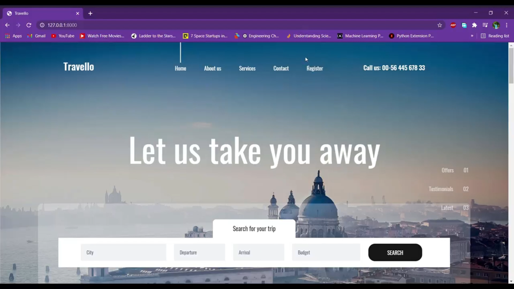

# Travello
A full stack web application which is entirely made of Django and HTML, CSS and Javascript files. This projects was a practice of my Full Stack ability to complete a entire website from the start till the backend using Postgres SQL. 

This website can be used to book tickets to travel places with the help of a login using user ID and password.

Copyright @Hemanath

The output images are as follows

